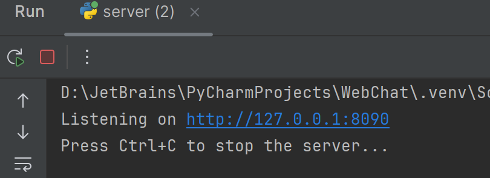

# Задание 3:

---

Реализовать серверную часть приложения. Клиент подключается к серверу, и в ответ получает HTTP-сообщение, содержащее HTML-страницу, которая сервер подгружает из файла index.html.


### Выполнение:

#### server.py

В этом задании также происходит инициализация сервера, создание и настройка сокета
и запуск прослушивания.

Основной цикл обработки запросов:

```python
        while running:
            try:
                client_socket, addr = server_socket.accept()
                print(f"Connection from {addr}")

                request = client_socket.recv(1024).decode()
                if request:
                    request_line = request.splitlines()[0]
                    method, path, _ = request_line.split()
                    print(f"Request Line: {request_line}")
                    print(f"Method: {method}")
                    print(f"Path: {path}")

                    http_response = create_http_response(html_content)
                    client_socket.sendall(http_response.encode('utf-8'))

                client_socket.close()

            except socket.timeout:
                continue
            except Exception as e:
                print(f"Error: {e}")
                if 'client_socket' in locals():
                    client_socket.close()
```

Сервер в бесконечном цикле принимает подключения. Таймаут позволяет периодически проверять флаг running для корректного завершения.

Сервер получает запрос: 
`                request = client_socket.recv(1024).decode()
`
Далее он его разбирает на 3 части: на метод, путь и версию протокола.

Дальше он формирует ответ:
```python
http_response = create_http_response(html_content)
client_socket.sendall(http_response.encode('utf-8'))
```

Структура ответа:

* Статусная строка: версия HTTP, код статуса, сообщение

* Заголовки: информация о содержимом

* Пустая строка: разделитель заголовков и тела

* Тело ответа: HTML-содержимое


#### Работа кода:
При зауске код выводит хост, на котором слушается сокет:



При переходе на этот адрес в браузере выводится следующее:

