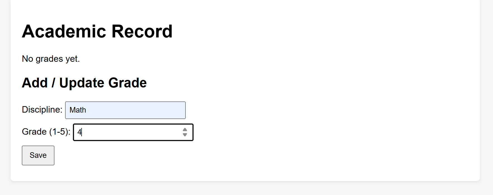

# Задание 5:

---

Написать простой веб-сервер для обработки GET и POST HTTP-запросов с помощью библиотеки socket в Python.

### Задание:

* Сервер должен:

        1. Принять и записать информацию о дисциплине и оценке по дисциплине.
        2. Отдать информацию обо всех оценках по дисциплинам в виде HTML-страницы.

### Выполнение:

Был сделан файл templates.py, в котором хранятся компоненты html для таблицы с оценками и поля ввода:
* get_body_template - основная структура (body) и стили к ней
* get_main_page - основная часть таблицы с оценками и формы ввода
* get_success_page - блок уведомления об успешном завершении процесса
* get_error_page - блок уведомления об ошибке

В файле server.py реализована основная логика. Реализован класс MyHTTPServer, который отвечает за все процессы на сервере.

* serve_forever - отвечает за создание сокета и прослушивание на выбранном порту и хосте, при подключении переходит на serve_client
* serve_client - Читает заголовки запроса до разделителя \r\n\r\n.

Разбирает первую строку (request line): METHOD PATH PROTOCOL, Парсит заголовки в словарь (ключи в нижнем регистре). 

Для POST парсит тело формы, проверяет поля и диапазон оценки, обновляет словарь.
Для GET генерирует HTML файл со списком оценок

Объект запроса после обработки собирается следующим образом:
```python
req = {
        'method': method.upper(),
        'path': path,
        'protocol': protocol,
        'headers': headers,
        'body': body
    }
```

Затем идет обработка запроса(GET/POST)

Далее метод send_response кодирует HTML строку в байты и отправляет по сокету все полученные байты заголовков.

#### Демонстрация

Ввод предмета и оценки:



Результат:

