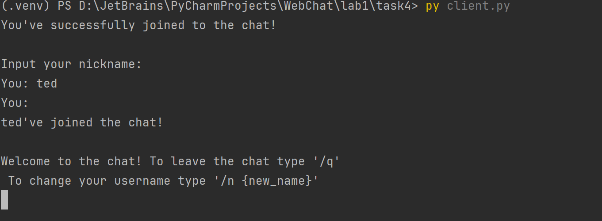
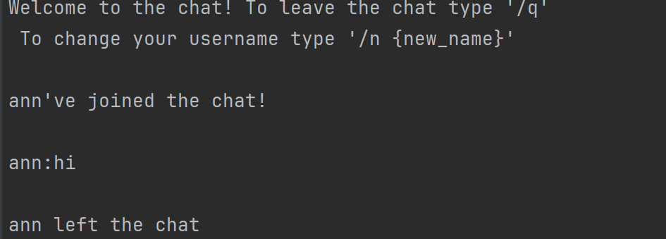

# Задание 4:

--- 

Реализовать двухпользовательский или многопользовательский чат. Для максимального количества баллов реализуйте многопользовательский чат.

### Требования:

* Обязательно использовать библиотеку socket.
* Для многопользовательского чата необходимо использовать библиотеку threading.


### Выполнение:

#### server.py

Сначала помимо библиотеки сокета импортируем библиотеку threading.
````python
import threading
````

Был создан класс ChatServer, имеющий методы sendAll, remove_client, handle_client и start.

##### sendAll()
```python
    def sendAll(self, message, sender=None):
        """Отправляет сообщение в чат всем, кроме отправителя (но если флаг exclude_sender=False, то и ему тоже)"""
        with self.lock:
            for client in self.clients:
                if client == sender:
                    continue
                try:
                    client.send(message.encode('utf-8'))
                except:
                    self.remove_client(client)
```

Этот метод используется как для опповещения клиентов, так и для рассылки сообщений.

##### remove_client()

```python
    def remove_client(self, client):
        """Удаление клиента из списка"""
        if client in self.clients:
            index = self.clients.index(client)
            nickname = self.nicknames[index]

            with self.lock:
                self.clients.remove(client)
                self.nicknames.remove(nickname)

            leave_message = f"{nickname} left the chat"
            print(leave_message)
            self.sendAll(leave_message)
            client.close()
```

Удаление клиента происходит путем удаления его из списка клиентов и из списка никнеймов


##### handle_client()

```python
    def handle_client(self, client, address):
        """Обработка информации от клиента"""
        try:
            client.send("Input your nickname: ".encode('utf-8'))
            nickname = client.recv(1024).decode('utf-8').strip()

            with self.lock:
                self.clients.append(client)
                self.nicknames.append(nickname)

            join_message = f"{nickname}'ve joined the chat!"
            print(join_message)
            self.sendAll(join_message)
            client.send("Welcome to the chat! To leave the chat type '/q'"
                        "\nTo change your username type '/n {new_name}'".encode('utf-8'))

            while True:
                message = client.recv(1024).decode('utf-8')

                if message == '/q':
                    break
                    
                    # что-то происходит ...
                    
               elif message.strip():
                    formatted_message = f"{nickname}:{message}"
                    print(formatted_message)
                    self.sendAll(formatted_message, client)

        except Exception as e:
            print(f"Exception with client {address}: {e}")
        finally:
            self.remove_client(client)
```
Этот метод обрабатывает сообщения, создает пользователя и выполняет зарезервированные команды. При появлении клиента ему создается никнейм, который и булет виден другим пользователям как его индентификатор.
Также здесь обрабатывается команда выхода, смены ника, а также отправка сообщений в чат.


##### start()

В этом методе инициализируется сокет, поток и реализуется процедура прекращения работы сервера.


#### client.py

В файле клиента реализован класс ChatClient, рассылающий сообщения со стороны клиента, получающий сообщения и также обрабатывающий зарезервированные команды выхода и смены ника.


#### Работа кода:
На скриншотах продемонстрирован вход юзера:


Вид со стороны сервера:


Уведомления в чате о присоединении:


Уведомления о смене ника:


Сообщения:

