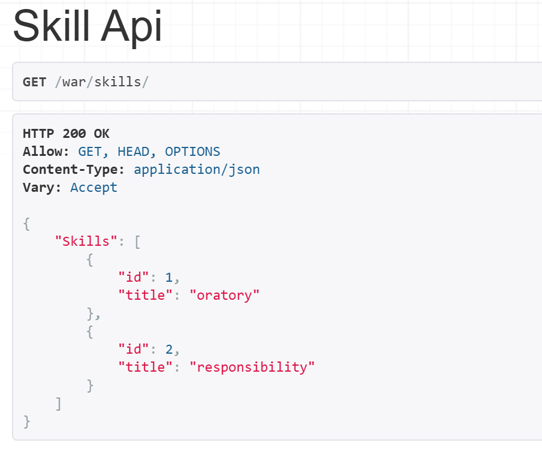
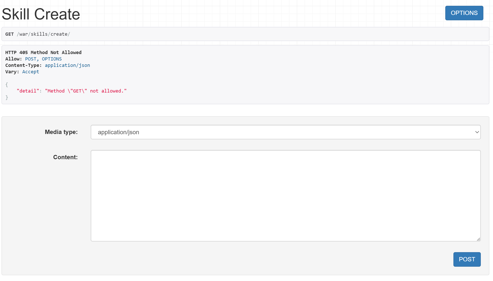

## Практическое задание №1

### Задание:

Реализовать ендпоинты для добавления и просмотра скилов методом, описанным в пункте выше.


### Выполнение

Создадим в файле serializers.py классы:

```python
class SkillSerializer(serializers.ModelSerializer):
    class Meta:
        model = Skill
        fields = "__all__"


class SkillCreateSerializer(serializers.ModelSerializer):
    class Meta:
        model = Skill
        fields = "__all__"
```

В файле views.py создадим вью методы:

```python
class SkillAPIView(APIView):
    def get(self, request):
        skills = Skill.objects.all()
        serializer = SkillSerializer(skills, many=True)
        return Response({"Skills": serializer.data})


class SkillCreateView(APIView):
    def post(self, request):
        skill = request.data.get("skill")
        serializer = SkillSerializer(data=skill)

        if serializer.is_valid(raise_exception=True):
            skill_saved = serializer.save()

        return Response({"Success": "Skill '{}' created succesfully.".format(skill_saved.title)})
```

Пропишем пути к этим ендпоинтам:

```python
path('warriors/skills/', WarriorSkillListAPIView.as_view()),
path('skills/create/', SkillCreateView.as_view()),
```

По итогу получаем:

GET:



PUT:

