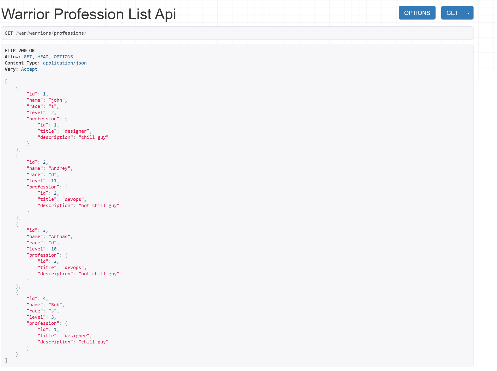
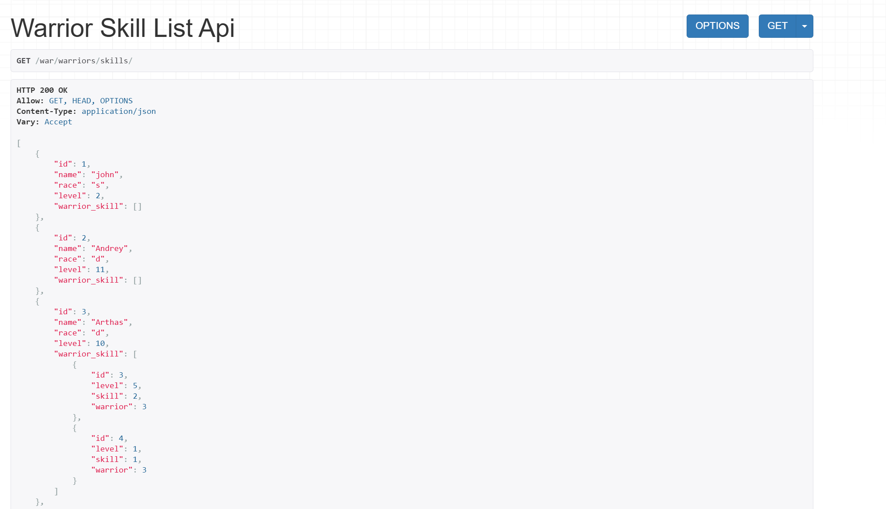
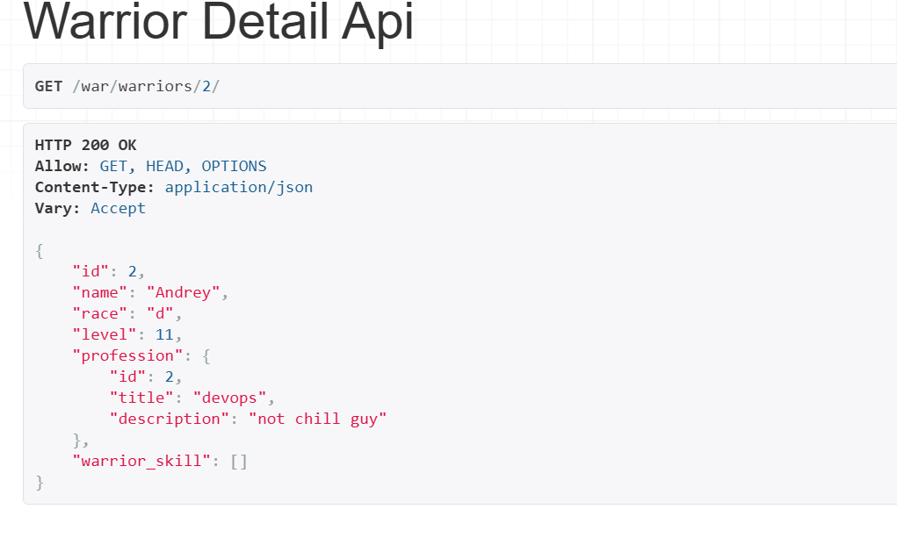
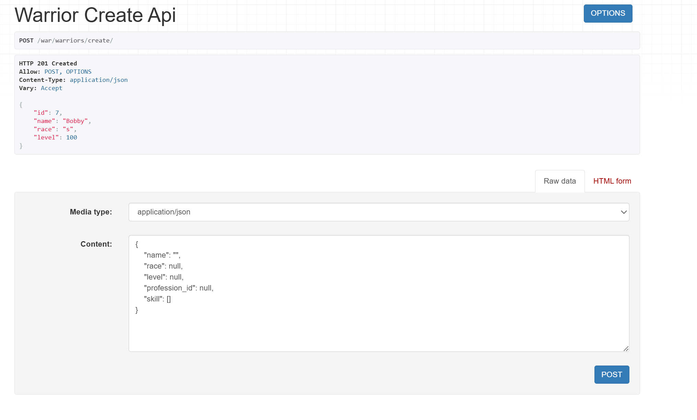
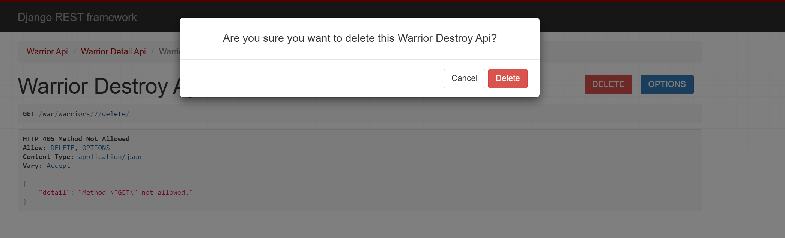
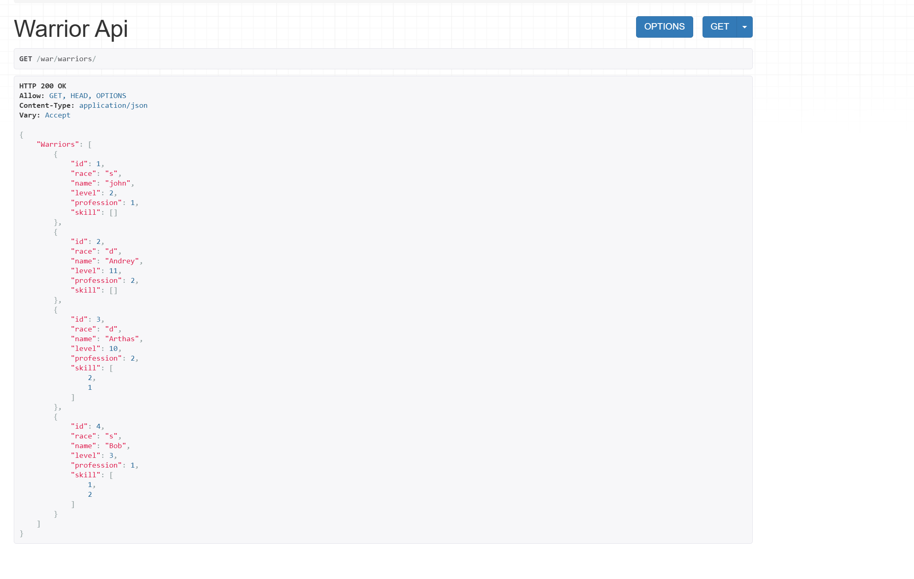
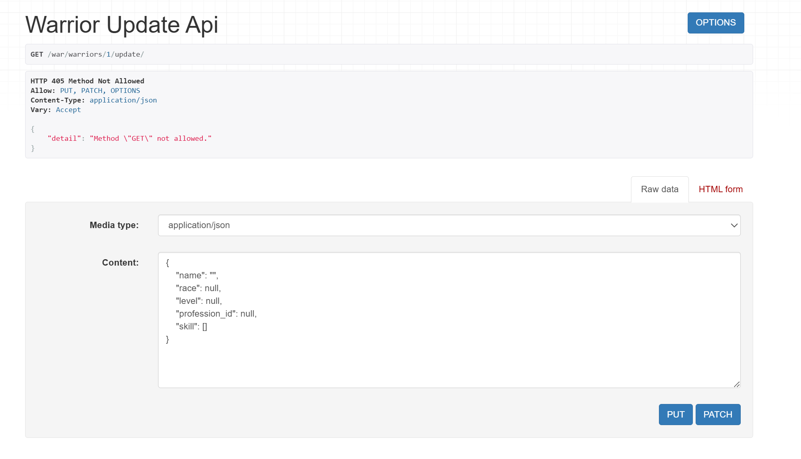

# Практическое задание №2

## Задание:

Реализовать ендпоинты:
* Вывод полной информации о всех войнах и их профессиях (в одном запросе).
* Вывод полной информации о всех войнах и их скиллах (в одном запросе).
* Вывод полной информации о войне (по id), его профессиях и скилах.
* Удаление война по id.
* Редактирование информации о войне.


## Выполнение

### Пропишем классы:

#### Для вывода информации о всех войнах и их профессиях:

В serializers.py:
```python
class WarriorProfessionSerializer(serializers.ModelSerializer):
    profession = ProfessionSerializer(read_only=True)

    class Meta:
        model = Warrior
        fields = ['id', 'name', 'race', 'level', 'profession']
```

В views.py:

```python
class WarriorProfessionListAPIView(generics.ListAPIView):
   serializer_class = WarriorProfessionSerializer
   queryset = Warrior.objects.all().select_related("profession")
```

#### Для вывода полной информации о всех войнах и их скиллах:

В serializers.py:
```python
class WarriorSkillSerializer(serializers.ModelSerializer):
    warrior_skill = SkillOfWarriorSerializer(many=True, read_only=True)

    class Meta:
        model = Warrior
        fields = ['id', 'name', 'race', 'level', 'warrior_skill']
```

В views.py:

```python
class WarriorSkillListAPIView(generics.ListAPIView):
    serializer_class = WarriorSkillSerializer
    queryset = Warrior.objects.all().prefetch_related("warrior_skill__skill")
```

#### Для вывода полной информации о войне (по id), его профессиях и скиллах:

В serializers.py:
```python
class WarriorFullSerializer(serializers.ModelSerializer):
    profession = ProfessionSerializer(read_only=True)
    warrior_skill = SkillOfWarriorSerializer(many=True, read_only=True)


    class Meta:
        model = Warrior
        fields = ['id', 'name', 'race', 'level', 'profession', 'warrior_skill']

```

В views.py:

```python
class WarriorDetailAPIView(generics.RetrieveAPIView):
    serializer_class = WarriorFullSerializer
    queryset = Warrior.objects.all().select_related("profession").prefetch_related("warrior_skill__skill")
    lookup_field = 'id'
```


#### Для удаления воина по id:

Пропишем во views.py:

```python
class WarriorDestroyAPIView(generics.DestroyAPIView):
    queryset = Warrior.objects.all()
    lookup_field = 'id'
```

#### Для редактирования информации о войне:

В serializers.py:
```python
class WarriorCreateUpdateSerializer(serializers.ModelSerializer):
    profession_id = serializers.IntegerField(write_only=True, required=False)
    skill = WarriorSkillInputSerializer(many=True, write_only=True, required=False)

    class Meta:
        model = Warrior
        fields = ['id', 'name', 'race', 'level', 'profession_id', 'skill']

    def create(self, validated_data):
        skill_data = validated_data.pop('skill', [])
        profession_id = validated_data.pop('profession_id', None)

        warrior = Warrior.objects.create(**validated_data)

        if profession_id:
            warrior.profession_id = profession_id
            warrior.save()

        # создаём записи в SkillOfWarrior
        for item in skill_data:
            SkillOfWarrior.objects.create(
                warrior=warrior,
                skill_id=item['id'],
                level=item['level']
            )

        return warrior

    def update(self, instance, validated_data):
        skill_data = validated_data.pop('skill', None)
        profession_id = validated_data.pop('profession_id', None)

        for attr, value in validated_data.items():
            setattr(instance, attr, value)

        if profession_id is not None:
            instance.profession_id = profession_id

        instance.save()

        if skill_data is not None:
            # полностью пересоздаём набор скиллов
            SkillOfWarrior.objects.filter(warrior=instance).delete()

            for item in skill_data:
                SkillOfWarrior.objects.create(
                    warrior=instance,
                    skill_id=item['id'],
                    level=item['level']
                )

        return instance
```

В views.py:

```python
class WarriorUpdateAPIView(generics.UpdateAPIView):
    serializer_class = WarriorCreateUpdateSerializer
    queryset = Warrior.objects.all()
    lookup_field = 'id'

class WarriorCreateAPIView(generics.CreateAPIView):
    serializer_class = WarriorCreateUpdateSerializer
    queryset = Warrior.objects.all()
```


### Добавим пути для ендпоинтов:

```python
urlpatterns = [
    path('warriors/', WarriorAPIView.as_view()),
    path('warriors/create/', WarriorCreateAPIView.as_view()),
    path('warriors/list/', WarriorListAPIView.as_view()),
    path('warriors/professions/', WarriorProfessionListAPIView.as_view()),
    path('warriors/skills/', WarriorSkillListAPIView.as_view()),
    path('warriors/<int:id>/', WarriorDetailAPIView.as_view()),
    path('warriors/<int:id>/delete/', WarriorDestroyAPIView.as_view()),
    path('warriors/<int:id>/update/', WarriorUpdateAPIView.as_view()),
    path('professions/generic_create/', ProfessionCreateAPIView.as_view()),
    path('skills/', SkillAPIView.as_view()),
    path('skills/generic_create/', SkillCreateAPIView.as_view()),
]
```


### Демонстрация работы:

#### 1. Вывод полной информации о всех войнах и их профессиях (в одном запросе).

#### 2. Вывод полной информации о всех войнах и их скиллах (в одном запросе).

#### 3. Вывод полной информации о войне (по id), его профессиях и скилах.

#### 4. Удаление война по id.
Создадим воина по имени Bobby:



А теперь убьем его:



И вуаля, воина с id 7 больше нет в списке:


#### 5. Редактирование информации о войне.

Редактирование также находится по одноименному пути:
